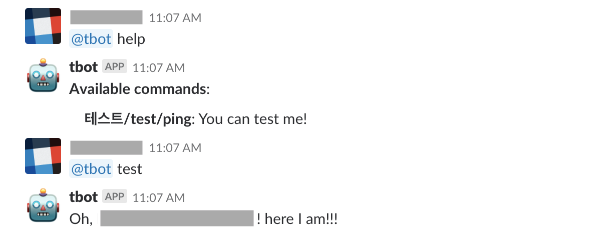
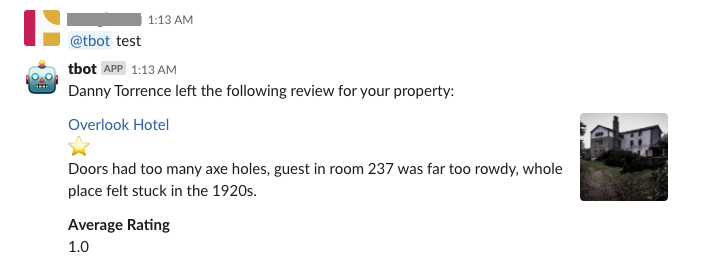

# Slaccato

> Structured Slack bot framework

## Installation

```shell
$ pip install slaccato
```

## Example

### General Usage

```python
import slaccato

# Write a new method
class TestMethod(slaccato.SlackMethod):
    @property
    def execution_words(self):
        return ['테스트', 'test', 'ping']

    @property
    def help_text(self):
        return '*{}*: You can test me!'.format('/'.join(self.execution_words))

    def response(self, channel, thread_ts, user_command, request_user):
        response = 'Oh, {}! here I am!!!'.format(request_user)
        return channel, thread_ts, response
    
slack_bot = slaccato.SlackBot(
    slack_bot_token='SLACK_BOT_TOKEN',
    slack_bot_name='SLACK_BOT_NAME',
    # Optional. Use default logger
    logger=None,
)

slack_bot.add_method(TestMethod)
slack_bot.run()
```



### Message Customization

Please see [Slack API documentations](https://slack.dev/python-slackclient/basic_usage.html#customizing-a-message-s-layout)

```python
import slaccato

# Write a new method
class TestMethod(slaccato.SlackMethod):
    @property
    def execution_words(self):
        return ['테스트', 'test', 'ping']

    @property
    def help_text(self):
        return '*{}*: You can test me!'.format('/'.join(self.execution_words))

    def response(self, channel, thread_ts, user_command, request_user):
        response = [
            {
                "type": "section",
                "text": {
                    "type": "mrkdwn",
                    "text": "Danny Torrence left the following review for your property:"
                }
            },
            {
                "type": "section",
                "text": {
                    "type": "mrkdwn",
                    "text": "<https://example.com|Overlook Hotel> \n :star: \n Doors had too many axe holes, guest in room " +
                    "237 was far too rowdy, whole place felt stuck in the 1920s."
                },
                "accessory": {
                    "type": "image",
                    "image_url": "https://images.pexels.com/photos/750319/pexels-photo-750319.jpeg",
                    "alt_text": "Haunted hotel image"
                }
            },
            {
                "type": "section",
                "fields": [
                    {
                        "type": "mrkdwn",
                        "text": "*Average Rating*\n1.0"
                    }
                ]
            }
        ]
        return channel, thread_ts, response
```



## [LICENSE](./LICENSE)
